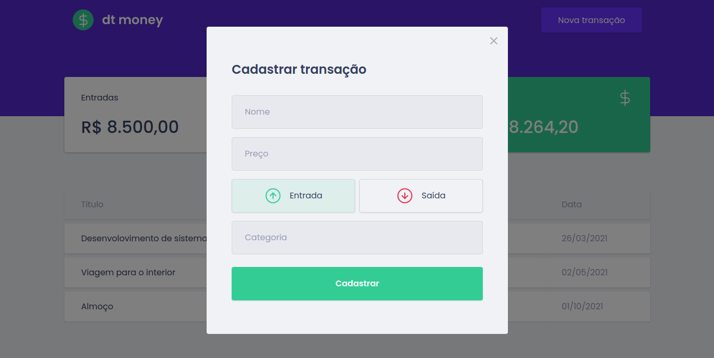

# Dt money

Is Application for managing finance inputs and outputs.

### Technologies used

> Typescript  
> ReactJs  
> Styled-components  
> MirageJs

## Pages

## To run project

In the project directory, you can run:

`yarn start` to run in development mode.

`yarn build` to create the build for production project.

## License

This project is under license [MIT](LICENCE)
